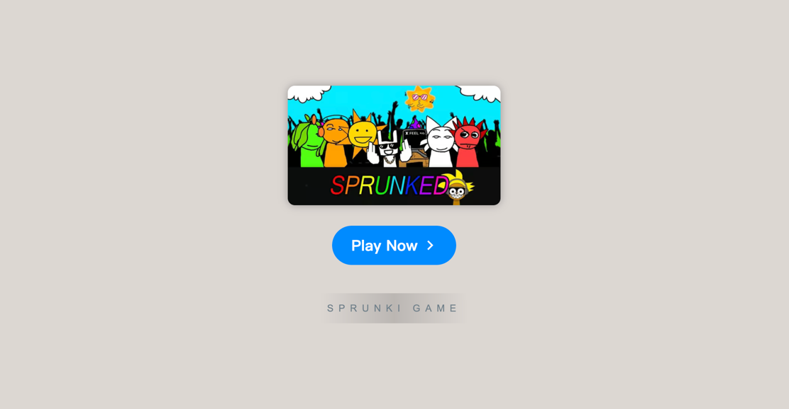

# Sprunki Sprungo

    

Welcome to **Sprunki Sprungo**, an exciting, fan-made game that brings a fresh twist to the classic Incredibox experience. Whether you're an avid Incredibox player or just discovering the world of Sprunki, this game offers a blend of unique characters, sounds, and thrilling gameplay. With each new phase and challenge, Sprunki Sprungo elevates your musical creativity to new heights, all while immersing you in an eerie yet captivating atmosphere.

### Table of Contents
- Introduction
- Features
- How to Play
- Ratings and Reviews
- Community and Sharing
- Resources

### Introduction

**Sprunki Sprungo** is an innovative take on the traditional Incredibox game, featuring new characters and soundtracks that provide a whole new musical experience. The game introduces a darker and more thrilling edge to the typical beat-making gameplay, offering players a unique way to engage with music creation. Whether you're here for the first time or a returning player, you're in for an exciting and unpredictable ride. Play it for free online and enjoy the full Sprunki experience.

### Features

| Feature                | Description                                                              |
|------------------------|--------------------------------------------------------------------------|
| **Sprunki Sound Design** | Compose unique beats with characters that have their own distinct sound. |
| **Phases and Challenges** | Multiple game phases, each with its own set of challenges and characters. |
| **Dark Mode**           | Add a chilling atmosphere to your music with the game's dark twist.       |
| **Rating System**       | Rate your music and see how others feel about your creations.            |
| **Play Online**         | No need for downloads — just jump in and start creating directly in your browser. |
| **Free Access**         | Enjoy all the features without any cost.                                |
| **Community Sharing**   | Share your compositions, get feedback, and discover other creators' works. |

### How to Play

**Sprunki Sprungo** allows players to compose and mix music by adding various characters to a sound grid. Here’s a quick guide to get started:

1. **Choose Your Characters**: Each character brings a different sound or musical effect. Drag and drop them into the grid to build your composition.
2. **Create Your Beat**: Experiment with different character combinations to craft the perfect rhythm and melody.
3. **Save & Share**: Once you're happy with your creation, save your track and share it with others in the Sprunki community.

### Ratings and Reviews

The game has received great reviews from players, with many highlighting its unique gameplay and chilling atmosphere.

    

        <svg width="16" viewBox="0 -960 960 960" height="16" xmlns="http://www.w3.org/2000/svg" style="--backgroundColor: #ffd223; --hoverColor: #ffd223; fill: #ffd223; " class="svelte-bpq1qa">
            <path d="m233-80 65-281L80-550l288-25 112-265 112 265 288 25-218 189 65 281-247-149L233-80Z" shape-rendering="geometricPrecision"></path>
        </svg>
        <svg width="16" viewBox="0 -960 960 960" height="16" xmlns="http://www.w3.org/2000/svg" style="--backgroundColor: #ffd223; --hoverColor: #ffd223; fill: #ffd223; " class="svelte-bpq1qa">
            <path d="m233-80 65-281L80-550l288-25 112-265 112 265 288 25-218 189 65 281-247-149L233-80Z" shape-rendering="geometricPrecision"></path>
        </svg>
        <svg width="16" viewBox="0 -960 960 960" height="16" xmlns="http://www.w3.org/2000/svg" style="--backgroundColor: #ffd223; --hoverColor: #ffd223; fill: #ffd223; " class="svelte-bpq1qa">
            <path d="m233-80 65-281L80-550l288-25 112-265 112 265 288 25-218 189 65 281-247-149L233-80Z" shape-rendering="geometricPrecision"></path>
        </svg>
        <svg width="16" viewBox="0 -960 960 960" height="16" xmlns="http://www.w3.org/2000/svg" style="--backgroundColor: #ffd223; --hoverColor: #ffd223; fill: #ffd223; " class="svelte-bpq1qa">
            <path d="m233-80 65-281L80-550l288-25 112-265 112 265 288 25-218 189 65 281-247-149L233-80Z" shape-rendering="geometricPrecision"></path>
        </svg>
        <svg width="16" viewBox="0 -960 960 960" height="16" xmlns="http://www.w3.org/2000/svg" style="--backgroundColor: #9E9E9E;--hoverColor: #9E9E9E;fill: #9E9E9E;" class="svelte-bpq1qa">
            <path d="m233-80 65-281L80-550l288-25 112-265 112 265 288 25-218 189 65 281-247-149L233-80Z" shape-rendering="geometricPrecision"></path>
        </svg>
    

### Community and Sharing

Join a growing community of Sprunki players and share your creations with the world. The game allows users to save and showcase their music, offering a platform to engage with other players, give and receive feedback, and discover new music. Whether you're a seasoned musician or a first-time composer, you'll find plenty of inspiration and support from the Sprunki community.

### Resources

For more information, tips, and updates, be sure to check out the official Sprunki website and follow the game on social media for the latest news and features.

- [Official Website](https://sprunkionline.com)
- [Sprunki Phase](https://sprunkionline.com/category/sprunki-phase)
